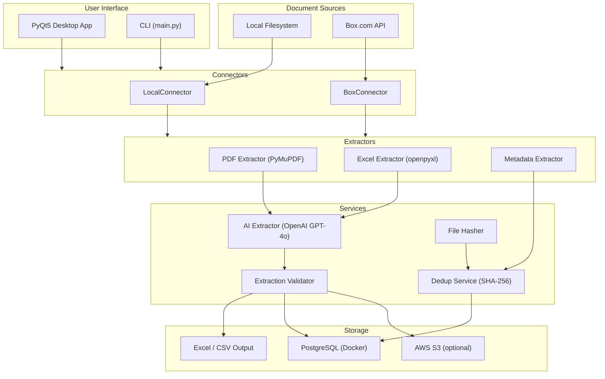

# AI Document Analyzer

An AI-powered desktop application for extracting structured data from insurance and reinsurance documents. It uses OpenAI GPT-4o to analyze PDFs, Excel files, and images, returning structured fields such as dates, parties, financial terms, and custom question-based extractions.

## Features

- **AI-Powered Extraction** -- Uses OpenAI GPT-4o with vision capabilities to extract structured data from documents
- **Multiple Document Sources** -- Process files from your local filesystem or directly from Box.com
- **Desktop GUI** -- Full-featured PyQt5 interface with tabs for source selection, custom questions, processing, results, folder watching, and settings
- **CLI Mode** -- Command-line interface for batch processing and scripting
- **Document Deduplication** -- SHA-256 content hashing with PostgreSQL storage to skip already-processed files
- **Custom Questions** -- Define your own extraction questions and map them to output columns
- **Folder Watching** -- Automatically process new documents added to watched folders (Box or local)
- **Multiple Output Formats** -- Results saved to Excel, CSV, and PostgreSQL database
- **AWS Integration** (optional) -- S3 document storage and RDS PostgreSQL backend

## Architecture



## Prerequisites

Before setting up this project, make sure you have the following installed:

| Requirement | Version | Purpose |
|---|---|---|
| **Python** | 3.11+ | Runtime |
| **Docker Desktop** | Latest | Runs PostgreSQL database |
| **Git** | Latest | Clone the repository |
| **OpenAI API Key** | -- | Required for AI document extraction |
| Box.com Credentials | -- | *Optional* -- only if using Box as a document source |
| AWS Credentials | -- | *Optional* -- only if using S3/RDS storage |

## Installation

### 1. Install Docker Desktop

Docker is required to run the PostgreSQL database.

1. Download Docker Desktop from [https://www.docker.com/products/docker-desktop](https://www.docker.com/products/docker-desktop)
2. Run the installer and follow the prompts
3. After installation, launch Docker Desktop and wait for it to fully start (the whale icon in the system tray should stop animating)
4. Verify the installation:
   ```bash
   docker --version
   docker-compose --version
   ```

> **Note:** On Windows, Docker Desktop requires WSL 2. The installer will prompt you to enable it if needed. You may need to restart your computer after installation.

### 2. Clone the Repository

```bash
git clone https://github.com/Debog-Automations/AI_Doc_Analyzer.git
cd AI_Doc_Analyzer
```

### 3. Create a Virtual Environment

**Windows (PowerShell):**

```powershell
python -m venv venv
.\venv\Scripts\Activate.ps1
```

**macOS / Linux:**

```bash
python3 -m venv venv
source venv/bin/activate
```

### 4. Install Python Dependencies

```bash
pip install -r requirements.txt
```

### 5. Start the PostgreSQL Database

The project uses a Docker container for PostgreSQL. The database schema is automatically initialized on first start via `init.sql`.

```bash
docker-compose up -d
```

This starts a PostgreSQL 16 container with:
- **Container name:** `doc_analyzer_postgres`
- **Port:** `5432`
- **Database:** `document_registry`
- **User:** `docanalyzer`
- **Password:** `docanalyzer_secret`

Verify the container is running:

```bash
docker ps
```

You should see `doc_analyzer_postgres` listed and healthy.

### 6. Verify Database Connection

```bash
python test_db_connection.py
```

You should see output confirming a successful connection and document count.

### 7. Configure Environment Variables

Copy the example file and fill in your values:

```bash
cp .env.example .env
```

Then edit `.env` with your credentials:

```dotenv
# ===========================================
# REQUIRED
# ===========================================
OPENAI_API_KEY=sk-your-openai-api-key-here

# ===========================================
# DATABASE (defaults match docker-compose.yml)
# ===========================================
DB_HOST=localhost
DB_PORT=5432
DB_NAME=document_registry
DB_USER=docanalyzer
DB_PASSWORD=docanalyzer_secret

# ===========================================
# BOX.COM API (optional - for Box source)
# ===========================================
# For CCG authentication:
BOX_CLIENT_ID=your-box-client-id
BOX_CLIENT_SECRET=your-box-client-secret
BOX_ENTERPRISE_ID=your-enterprise-id
BOX_USER_ID=your-box-user-id

# For quick testing (valid 60 minutes):
# BOX_DEVELOPER_TOKEN=your-developer-token

# ===========================================
# AWS (optional - for S3/RDS storage)
# ===========================================
# AWS_ACCESS_KEY_ID=your-access-key
# AWS_SECRET_ACCESS_KEY=your-secret-key
# AWS_REGION=us-east-1
# AWS_S3_BUCKET=your-bucket-name
# AWS_RDS_HOST=your-rds-endpoint
# AWS_RDS_PASSWORD=your-rds-password
```

> **Important:** The `.env` file is included in `.gitignore` and will not be committed to the repository. Never commit API keys or secrets.

## Configuration

### `app_config.json`

This file stores application-level settings. It is created with sensible defaults and can be edited via the GUI Settings tab or manually. Key settings:

| Setting | Default | Description |
|---|---|---|
| `db_host` | `localhost` | PostgreSQL host |
| `db_port` | `5432` | PostgreSQL port |
| `db_name` | `document_registry` | Database name |
| `db_user` | `docanalyzer` | Database username |
| `db_password` | `docanalyzer_secret` | Database password |
| `process_all_pages` | `true` | Send all PDF pages as images to OpenAI |
| `max_vision_pages` | `10` | Max pages to process when `process_all_pages` is false |
| `watch_enabled` | `false` | Enable automatic folder watching |
| `watch_folders` | `["/Documents"]` | Folders to watch for new documents |
| `watch_interval_minutes` | `5` | How often to check for new documents |
| `watch_source_type` | `box` | Source type for watcher (`box` or `local`) |
| `custom_questions` | *(see file)* | List of extraction questions with column mappings |

### Custom Questions

The `custom_questions` array in `app_config.json` defines what the AI extracts. Each entry has:

```json
{
  "question": "What is the document title?",
  "column_name": "Title"
}
```

- `question` -- The prompt sent to OpenAI for extraction
- `column_name` -- The output column header in Excel/CSV and database

You can add, remove, or modify questions through the GUI **Questions** tab or by editing `app_config.json` directly.

## Running the Application

### GUI Mode (Desktop Application)

```bash
python app.py
```

This launches the PyQt5 desktop application with six tabs:

| Tab | Purpose |
|---|---|
| **Source** | Select documents from local filesystem or Box.com |
| **Questions** | Configure custom extraction questions |
| **Processing** | Run extraction with real-time progress logging |
| **Watcher** | Set up automatic folder monitoring |
| **Results** | View, filter, and export processed documents |
| **Settings** | Configure API keys, database, and processing options |

### CLI Mode

```bash
python main.py "path/to/document.pdf"
```

Processes one or more documents from the command line. Results are written to Excel and CSV in the output directories.

### Single File Extraction

For quick testing or debugging, edit the configuration at the top of the script and run:

```bash
python extract_single.py
```

Configuration variables inside the script:
- `FILE_PATH` -- Path to the document
- `EXTRACTION_MODE` -- `"metadata"`, `"ai"`, or `"both"`
- `SAVE_TO_JSON` / `SAVE_TO_EXCEL` -- Output format toggles

## Project Structure

```
AI_Doc_Analyzer/
├── app.py                    # Desktop GUI entry point
├── main.py                   # CLI entry point
├── extract_single.py         # Single-file extraction utility
├── config.py                 # Configuration and question definitions
├── app_config.json           # Application settings (editable via GUI)
├── logger.py                 # Centralized logging (console + rotating file)
├── boxAPI.py                 # Box.com API client (CCG & Developer Token auth)
├── ai_processor.py           # Legacy AI processor (used by CLI mode)
├── output_handler.py         # Excel/CSV output writer
├── test_db_connection.py     # Database connection verification script
├── docker-compose.yml        # PostgreSQL container definition
├── init.sql                  # Database schema initialization
├── requirements.txt          # Python dependencies
├── .env                      # Environment variables (not tracked in git)
├── .gitignore                # Git ignore rules
│
├── connectors/               # Document source connectors
│   ├── base_connector.py     #   Abstract base class (FileInfo, FolderInfo)
│   ├── local_connector.py    #   Local filesystem connector
│   └── box_connector.py      #   Box.com API connector
│
├── extractors/               # File content extractors
│   ├── pdf_extractor.py      #   PDF text + image extraction (PyMuPDF)
│   ├── excel_extractor.py    #   Excel content extraction (openpyxl)
│   └── metadata_extractor.py #   File metadata extraction (size, dates, hash)
│
├── schemas/                  # Data models
│   └── universal_schema.py   #   Pydantic models for AI extraction output
│
├── services/                 # Business logic services
│   ├── ai_extractor.py       #   OpenAI GPT-4o extraction with retry logic
│   ├── dedup.py              #   Document deduplication (PostgreSQL-backed)
│   ├── hasher.py             #   SHA-256 file hashing
│   ├── validator.py          #   Extraction result validation
│   ├── folder_scanner.py     #   Folder scanning for batch processing
│   └── aws.py                #   AWS S3 and RDS integration
│
├── ui/                       # PyQt5 desktop interface
│   ├── main_window.py        #   Main application window
│   └── tabs/                 #   Tab widgets
│       ├── source_tab.py     #     Document source selection
│       ├── questions_tab.py  #     Custom question configuration
│       ├── processing_tab.py #     Processing with progress display
│       ├── watcher_tab.py    #     Folder watching setup
│       ├── results_tab.py    #     Results viewing and export
│       └── settings_tab.py   #     Application settings
│
└── logs/                     # Application log files (auto-created)
    └── app.log               #   Rotating log file (5 MB, 5 backups)
```

## Supported File Types

| File Type | Extensions | Extraction Method |
|---|---|---|
| PDF | `.pdf` | Text extraction + page images for visual context |
| Excel | `.xlsx`, `.xlsm`, `.xls` | Cell content extraction via openpyxl |
| Images | `.png`, `.jpg`, `.jpeg`, `.tiff` | Direct image analysis via GPT-4o vision |

## Troubleshooting

### Docker / Database Issues

**"Connection refused" or "could not connect to server"**

1. Make sure Docker Desktop is running
2. Start the database container:
   ```bash
   docker-compose up -d
   ```
3. Wait a few seconds for PostgreSQL to fully initialize, then verify:
   ```bash
   docker ps
   python test_db_connection.py
   ```

**Container exists but won't start**

```bash
docker-compose down
docker-compose up -d
```

**Reset the database (deletes all data)**

```bash
docker-compose down -v
docker-compose up -d
```

### OpenAI API Issues

**"OpenAI API key not provided"**

Make sure your `.env` file contains a valid `OPENAI_API_KEY` and that the file is in the project root directory.

**Rate limit or timeout errors**

The AI extractor includes retry logic. If you consistently hit rate limits, reduce `max_vision_pages` in `app_config.json` to send fewer images per request.

### Box.com Issues

**"Box authentication failed"**

- Verify your credentials in the `.env` file or the GUI Settings tab
- For Developer Token auth: tokens expire after 60 minutes -- generate a new one from the Box Developer Console
- For CCG auth: ensure your Box application has the correct scopes enabled and is authorized for your enterprise

### GUI Issues

**Application won't start or shows a blank window**

- Ensure PyQt5 is installed: `pip install PyQt5`
- On Linux, you may need additional system packages:
  ```bash
  sudo apt-get install python3-pyqt5
  ```

### General

**"ModuleNotFoundError"**

Make sure you have activated your virtual environment and installed all dependencies:

```bash
# Windows
.\venv\Scripts\Activate.ps1

# macOS/Linux
source venv/bin/activate

pip install -r requirements.txt
```
